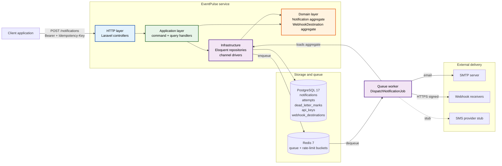
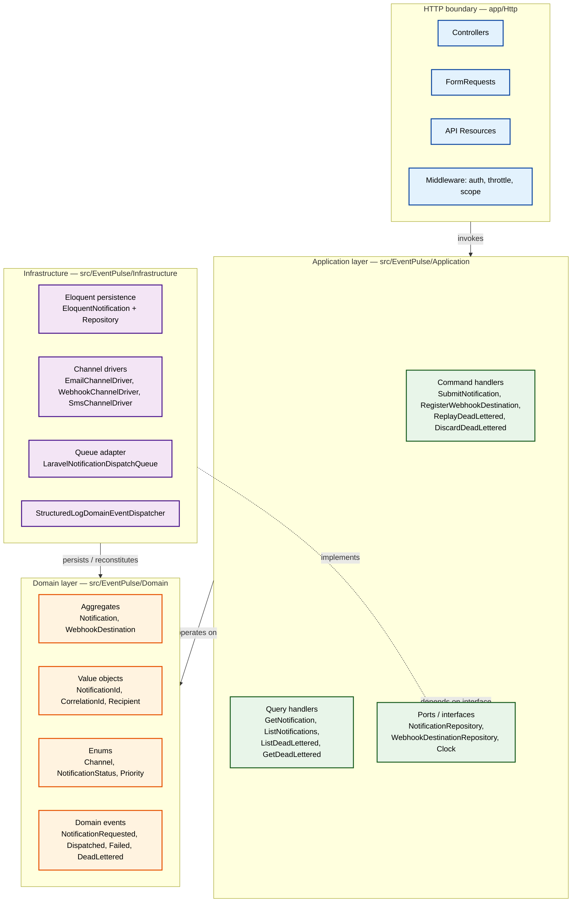
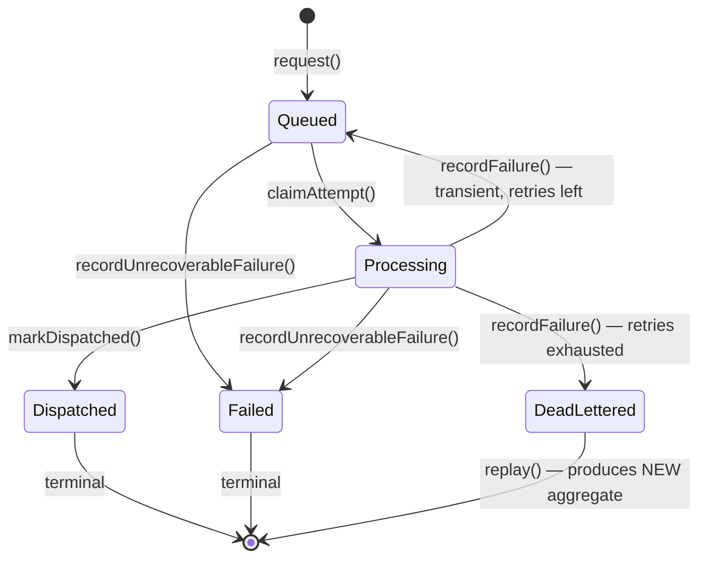
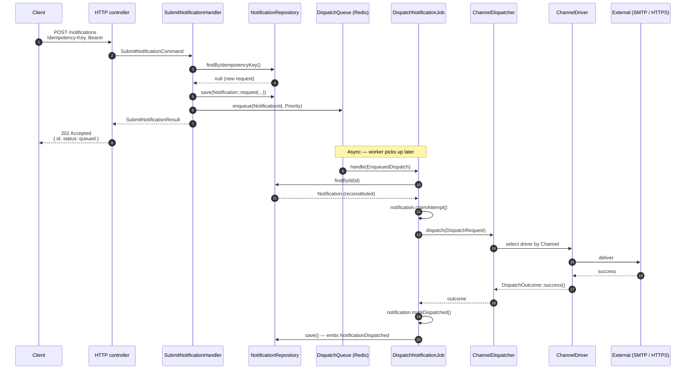

# EventPulse

> An event-driven notification dispatch service. Boring, reliable, observable.

[](https://github.com/Pavel-Progrer/eventpulse/actions/workflows/ci.yml)
[](https://www.php.net/)
[](https://laravel.com/)
[](https://github.com/Pavel-Progrer/eventpulse/releases/tag/v0.1.0)
[](./LICENSE.md)

**Phase 1 shipped.** [`v0.1.0`](https://github.com/Pavel-Progrer/eventpulse/releases/tag/v0.1.0) is the first complete release — core API, async dispatch across three channels, retry with backoff, dead-letter handling, structured logging, rate limiting, and a published OpenAPI spec. Phase 2 (containers + CI/CD hardening) and Phase 3 (semantic search + LLM variants) follow. See the [Roadmap](#roadmap).

EventPulse is a Laravel service for dispatching notifications across channels — email, webhook, SMS — with the production qualities these systems actually need: idempotency, retries with backoff, dead-letter handling, structured observability, and a minimal attack surface.

It is a portfolio project, built to the standards of a system I would put into production for a client tomorrow. Every non-obvious architectural decision is documented as an [Architecture Decision Record](./docs/adr/). The exclusions are as deliberate as the inclusions — see [ADR-0001](./docs/adr/0001-scope-and-exclusions.md) for what EventPulse is and isn't, and why.

---

## Table of contents

- [What it does](#what-it-does)
- [What it deliberately doesn't do](#what-it-deliberately-doesnt-do)
- [Architecture](#architecture)
- [API at a glance](#api-at-a-glance)
- [Running locally](#running-locally)
- [Testing](#testing)
- [Documentation](#documentation)
- [Roadmap](#roadmap)

---

## What it does

**In `v0.1.0` (Phase 1, shipped):**

- ✅ Accepts notification dispatch requests via an authenticated REST API (bearer-token API keys with per-key scopes)
- ✅ Dispatches through three pluggable channels — **email**, **webhook**, **SMS stub** — via a strategy-based dispatcher
- ✅ Guarantees **at-least-once delivery** with idempotency keys ensuring a request is never processed twice within the configured window
- ✅ Retries transient failures with **exponential backoff and jitter**, per-channel configuration, status-aware classification (4xx vs 5xx vs network)
- ✅ Dead-letters permanent failures with admin endpoints for **inspection**, **replay**, and **discard**
- ✅ Signs outbound webhooks with **HMAC-SHA256** over a timestamped payload (replay-resistant)
- ✅ **Structured JSON logging** with correlation IDs threaded through every step of the dispatch flow
- ✅ **Per-key rate limiting** with separate buckets for write and read operations; IP throttling for unauthenticated probes
- ✅ **Liveness and readiness** probes for orchestrator integration
- ✅ Complete **OpenAPI 3.1 spec** for the public API surface
- ✅ Three-layer testing pyramid: framework-free unit tests, full HTTP feature tests, and integration tests for adapters

**Planned for `v0.2.0` (Phase 2):**

- Multi-stage Dockerfile producing a **~80MB distroless final image**
- GitHub Actions CI/CD with Psalm, PHPStan, Pint, Roave Security Advisories, Trivy, gitleaks
- Deployment runbook, security model, secrets-rotation procedure

**Planned for `v1.0.0` (Phase 3):**

- **Semantic search** over notification history using pgvector (hybrid query: vector similarity + keyword)
- **LLM-generated channel variants** — one canonical payload, channel-appropriate text via Anthropic with OpenAI fallback, content-addressed caching

## What it deliberately doesn't do

No Kubernetes. No Kafka. No frontend. No event sourcing. No multi-service decomposition. No OAuth2.

Each omission is reasoned in [ADR-0001](./docs/adr/0001-scope-and-exclusions.md). The exclusions are the architectural thesis of the project — they are what the code does not contain by design, not what it hasn't gotten to yet.

---

## Architecture

### System overview



### Layered architecture

Four layers with explicit, enforced boundaries. The **domain layer is framework-free** — no `Illuminate\*`, no facades, no `env()`. It can be unit-tested without booting Laravel.



### Notification lifecycle

The state machine is enforced by `Notification::transitionTo()` consulting `NotificationStatus::canTransitionTo()`. **Dead-lettering** and the unrecoverable **failed** path both set status directly — each carries an invariant the enum cannot know (`dead_lettered` requires ≥ 1 failed attempt; `failed` is the "never got to try" path used when, e.g., a webhook destination is deleted between submission and worker pickup).



Replay does not transition the original — it creates a new `Notification` aggregate linked back by `replay_of_id`. See [ADR-0002 §3.1](./docs/adr/0002-domain-model-structure.md) and [`docs/domain.md` §4](./docs/domain.md#4-notification-lifecycle).

### Dispatch flow (happy path)



Detailed design notes and per-decision reasoning live in [`docs/`](./docs/) and the ADRs.

---

## API at a glance

Every endpoint is versioned under `/api/v1/`. Full reference is in [`openapi.yaml`](./openapi.yaml) (served at `/api/docs`).

| Method | Path                            | Scope                 | Purpose                                          |
|--------|---------------------------------|-----------------------|--------------------------------------------------|
| POST   | `/notifications`                | `notifications:write` | Submit a new notification (async accept, `202`)  |
| GET    | `/notifications`                | `notifications:read`  | List notifications, cursor-paginated             |
| GET    | `/notifications/{id}`           | `notifications:read`  | Inspect a notification + its attempts            |
| GET    | `/dlq`                          | `dlq:read`            | List dead-lettered notifications                 |
| GET    | `/dlq/{id}`                     | `dlq:read`            | Inspect one dead-lettered notification           |
| POST   | `/dlq/{id}/replay`              | `dlq:replay`          | Replay (creates a new notification, links back)  |
| DELETE | `/dlq/{id}`                     | `dlq:replay`          | Discard from the DLQ (idempotent)                |
| POST   | `/webhook-destinations`         | `notifications:write` | Register a webhook destination + plaintext secret|
| GET    | `/webhook-destinations`         | `notifications:read`  | List destinations for the calling key            |
| DELETE | `/webhook-destinations/{id}`    | `notifications:write` | Disable a destination (soft delete)              |
| GET    | `/health`                       | *(no auth)*           | Liveness probe                                   |
| GET    | `/health/detailed`              | *(no auth, IP-throttled)* | Readiness probe — DB + Redis checks          |

### Standardized error envelope

Every error response follows this shape, including validation, auth, and rate-limit failures:

```json
{
  "error": {
    "code": "VALIDATION_ERROR",
    "message": "The request body is invalid.",
    "details": {
      "fields": [
        { "path": "recipient", "message": "Must be a valid email address." }
      ]
    }
  }
}
```

Status codes are semantic: `200` reads, `201` creates, `202` async accepts, `204` no-content, `401` unauthenticated, `403` missing scope, `404` not found, `409` idempotency conflict, `422` validation, `429` rate limit, `503` temporary unavailability. See [`docs/adr/0003-http-boundary-and-application-services.md`](./docs/adr/0003-http-boundary-and-application-services.md).

---

## Running locally

**Prerequisites:** Docker, Docker Compose.

```bash
git clone https://github.com/Pavel-Progrer/eventpulse.git
cd eventpulse
cp .env.example .env
docker-compose up -d
docker-compose exec php-fpm php artisan key:generate
docker-compose exec php-fpm php artisan migrate
```

The API is available at `http://localhost:8080`. The OpenAPI spec is served at `/api/docs`. Outbound mail is captured by **Mailpit** at `http://localhost:8025`. API keys are provisioned via Artisan command (no self-service signup; see [ADR-0001](./docs/adr/0001-scope-and-exclusions.md)).

### Environment variables

Configuration is split across two files, both gitignored, both with committed `.example` counterparts:

- **`.env`** — local development. Copy from `.env.example` after cloning.
- **`.env.testing`** — overrides applied when `APP_ENV=testing` (set globally by `phpunit.xml`). Covered in [Setting up the test environment](#setting-up-the-test-environment) below.

Hostnames in both files refer to **Docker service names** (`postgres`, `redis`, `mailpit`) — these resolve inside the `eventpulse-net` bridge network defined by `docker-compose.yaml`. If you ever run `php artisan` from your host shell rather than through `docker-compose exec`, swap them for `127.0.0.1`.

| Variable | `.env` (dev) | `.env.testing` | Notes |
|---|---|---|---|
| `APP_ENV` | `local` | `testing` | Drives which env file Laravel loads. |
| `APP_KEY` | (generated) | (generated) | Encrypts `webhook_destinations.secret`; see [ADR-0007](./docs/adr/0007-secrets-management.md). |
| `DB_CONNECTION` | `pgsql` | `pgsql` | Required — migrations use `jsonb` and `TIMESTAMPTZ`. |
| `DB_HOST` | `postgres` | `postgres` | Compose service name. |
| `DB_DATABASE` | `eventpulse` | `eventpulse_test` | Separate databases prevent `RefreshDatabase` from erasing dev data. |
| `REDIS_HOST` | `redis` | `redis` | Queue backend + rate-limit buckets. |
| `QUEUE_CONNECTION` | `redis` | `sync` | Tests run jobs synchronously; nothing is enqueued. |
| `CACHE_STORE` | `redis` | `array` | Tests use in-memory cache; nothing leaks between runs. |
| `MAIL_MAILER` | `smtp` | `array` | Dev mail goes to Mailpit (UI at `http://localhost:8025`); tests collect mail in memory. |
| `ANTHROPIC_API_KEY` | empty until Phase 3 | empty | LLM provider; see ADR-0010. |
| `OPENAI_API_KEY` | empty until Phase 3 | empty | Fallback provider. |

Secrets handling follows [ADR-0007](./docs/adr/0007-secrets-management.md): no `.env` file is ever committed, production injects environment variables via the orchestrator's secret mechanism, and `gitleaks` runs in CI as defence-in-depth from `v0.2.0`.

### Making a test request

```bash
curl -X POST http://localhost:8080/api/v1/notifications \
  -H "Authorization: Bearer $API_KEY" \
  -H "Idempotency-Key: $(uuidgen)" \
  -H "Content-Type: application/json" \
  -d '{
    "channel": "email",
    "recipient": "user@example.com",
    "payload": {
      "subject": "Hello from EventPulse",
      "body_text": "Plain text body."
    }
  }'
```

Expected response (HTTP 202; full schema in `NotificationAcceptedResource`):

```http
HTTP/1.1 202 Accepted
Content-Type: application/json

{
  "id": "0193f1d0-9c54-7a5e-9d8b-f7a3e2b4c1d2",
  "status": "queued",
  "correlation_id": "0193f1d0-9c54-7a5e-9d8b-f7a3e2b4c1d3",
  "created_at": "2026-05-14T12:00:00+00:00",
  "_links": {
    "self": "/api/v1/notifications/0193f1d0-9c54-7a5e-9d8b-f7a3e2b4c1d2"
  }
}
```

The `202` response is a *receipt*, not a status snapshot — it confirms acceptance, not delivery. Full status (with attempts, `dispatched_at`, etc.) is fetched via `GET /api/v1/notifications/{id}`.

### Idempotency and asynchronous dispatch

Every `POST /notifications` request must carry an `Idempotency-Key` header. The contract:

- **First submission** → `202 Accepted`; the notification is persisted, a `DispatchNotificationJob` is enqueued, and the response carries the assigned id.
- **Same key, identical body, same API key, within 24 h** → `200 OK`; the original response is returned, no second persistence, no second enqueue. The original `correlation_id` is preserved — tracing identity belongs to the first submission.
- **Same key, *different* body** → `409 Conflict`; the second request is rejected and the original notification remains unchanged.
- Keys are **scoped per API key**: two callers using the same key value do not collide.

Dedup is done by indexed lookup against the `notifications.idempotency_key` column (composite-unique with `api_key_id`), not by a Redis cache of the response. The trade-offs are documented in `SubmitNotificationHandler`'s docblock; the choice is revisitable if the dedup-replay rate ever dominates the endpoint's latency budget.

Dispatch is asynchronous from acceptance: the HTTP path persists the notification and enqueues a job; the worker picks it up, claims an attempt, and runs the channel-specific dispatch logic. Priority is mapped to a queue name (`notifications-high`, `notifications-default`, `notifications-low`) so workers can be scaled per priority class.

### Webhook destinations

Before a webhook notification can be dispatched, the target URL must be
registered as a **webhook destination**.

```bash
# Register a destination (returns the id and — once only — the plaintext secret).
curl -X POST http://localhost:8080/api/v1/webhook-destinations \
  -H "Authorization: Bearer $API_KEY" \
  -H "Content-Type: application/json" \
  -d '{
    "url": "https://your-service.example.com/hooks",
    "secret": "'$(openssl rand -hex 32)'",
    "name": "My service"
  }'
# → 201 {"id": "...", "url": "...", "status": "active", "secret": "...", ...}
#   Save the secret now — it is never returned again.
```

The returned `id` is what you pass as `recipient` in `POST /notifications`
with `channel: webhook`.

```bash
# List destinations owned by the authenticated key.
curl http://localhost:8080/api/v1/webhook-destinations \
  -H "Authorization: Bearer $API_KEY"
# → 200 {"data": [...], "meta": {"next_cursor": null}}

# Disable a destination (soft delete — history is preserved).
curl -X DELETE http://localhost:8080/api/v1/webhook-destinations/$DESTINATION_ID \
  -H "Authorization: Bearer $API_KEY"
# → 204 No Content
```

#### Outbound signing

Every outbound webhook request carries two headers:

```
X-EventPulse-Timestamp: 1714298400
X-EventPulse-Signature: sha256=<hex-encoded HMAC-SHA256>
```

The signature is computed over `{timestamp}.{json_request_body}` using the
shared secret. Receiver verification (any language):

```python
import hashlib, hmac, time

def verify(secret: str, body: bytes, timestamp: str, signature: str) -> bool:
    # Reject stale timestamps (±5 minute window).
    if abs(time.time() - int(timestamp)) > 300:
        return False
    signed = f"{timestamp}.".encode() + body
    expected = "sha256=" + hmac.new(secret.encode(), signed, hashlib.sha256).hexdigest()
    return hmac.compare_digest(expected, signature)
```

Full rationale in [ADR-0008](./docs/adr/0008-webhook-signature-verification.md).

### Inspecting the dead-letter queue

When retries are exhausted, notifications land in the DLQ for operator triage:

```bash
# List dead-lettered notifications (cursor-paginated, filterable).
curl "http://localhost:8080/api/v1/dlq?channel=webhook&reason=permanent" \
  -H "Authorization: Bearer $ADMIN_KEY"

# Inspect one — returns the notification plus its full attempt history.
curl http://localhost:8080/api/v1/dlq/$NOTIFICATION_ID \
  -H "Authorization: Bearer $ADMIN_KEY"

# Replay — creates a NEW notification linked back by replay_of_id.
curl -X POST http://localhost:8080/api/v1/dlq/$NOTIFICATION_ID/replay \
  -H "Authorization: Bearer $ADMIN_KEY" \
  -H "Idempotency-Key: $(uuidgen)"

# Discard — removes from DLQ listing; the notification remains for audit.
curl -X DELETE http://localhost:8080/api/v1/dlq/$NOTIFICATION_ID \
  -H "Authorization: Bearer $ADMIN_KEY"
```

Replay creates a fresh aggregate that goes through the full dispatch flow as if newly submitted. The original notification is preserved with its history intact. See [`docs/adr/0006-dlq-admin-and-structured-logging.md`](./docs/adr/0006-dlq-admin-and-structured-logging.md).

---

## Testing

### Setting up the test environment

The feature suite uses Laravel's `RefreshDatabase` trait, which re-runs migrations against the configured database between test classes. It must therefore point at a **separate database** — pointing it at `eventpulse` would erase your local development data.

A SQLite-in-memory fallback (a common Laravel shortcut) isn't viable here: the migrations rely on PostgreSQL features that SQLite doesn't implement (`jsonb`, `TIMESTAMPTZ`, `CHECK` constraints).

**One-time setup, after `docker-compose up -d`:**

```bash
# Create the dedicated test database on the same Postgres instance.
docker-compose exec postgres psql -U eventpulse -d eventpulse \
    -c "CREATE DATABASE eventpulse_test OWNER eventpulse;"

# Configure the test environment.
cp .env.testing.example .env.testing
docker-compose exec php-fpm php artisan key:generate --env=testing
```

`.env.testing` carries database credentials and test-shape settings (`QUEUE_CONNECTION=sync`, `CACHE_STORE=array`, `MAIL_MAILER=array`) that keep test runs hermetic — no Redis writes, no mail dispatched, no jobs queued.

`phpunit.xml` only contains constants that should be identical on every developer's machine (`APP_ENV=testing`, `BCRYPT_ROUNDS=4` for hash-comparison speed). Credentials live in `.env.testing` to keep secrets out of version control.

`RefreshDatabase` migrates the test database on its first run, so you do not need to run `php artisan migrate --env=testing` manually after creating the database.

### Running the suite

```bash
docker-compose exec php-fpm php artisan test --parallel             # full suite, parallel
docker-compose exec php-fpm php artisan test --testsuite=Unit       # framework-free, fastest
docker-compose exec php-fpm php artisan test --testsuite=Feature    # full HTTP round-trips
docker-compose exec php-fpm php artisan test --coverage --min=80    # with coverage
```

The suite is split deliberately:

- **Unit** — pure domain and application logic, no framework, no I/O. Fast (<5ms per test).
- **Integration** — queue behavior, database repositories, third-party adapters (mocked at the HTTP boundary).
- **Feature** — full HTTP round-trips against the test database with `Bus::fake()` intercepting workers.

Testing philosophy, test-double inventory, and coverage targets are in [`docs/testing-strategy.md`](./docs/testing-strategy.md).

---

## Documentation

- **[Architecture Decision Records](./docs/adr/)** — the reasoning behind every non-obvious choice:
  - [ADR-0001 — Scope and explicit exclusions](./docs/adr/0001-scope-and-exclusions.md)
  - [ADR-0002 — Domain model structure and aggregate boundaries](./docs/adr/0002-domain-model-structure.md)
  - [ADR-0003 — HTTP boundary, application services, and command DTOs](./docs/adr/0003-http-boundary-and-application-services.md)
  - [ADR-0004 — Channel dispatch via strategy pattern](./docs/adr/0004-channel-dispatch-strategy.md)
  - [ADR-0005 — Retry policy and dead-letter strategy](./docs/adr/0005-retry-policy-and-dead-letter-strategy.md)
  - [ADR-0006 — DLQ admin endpoints and structured logging](./docs/adr/0006-dlq-admin-and-structured-logging.md)
  - [ADR-0007 — Secrets management approach](./docs/adr/0007-secrets-management.md)
  - [ADR-0008 — Webhook signature verification](./docs/adr/0008-webhook-signature-verification.md)
  - [ADR-0009 — Rate limiting and health endpoints](./docs/adr/0009-rate-limiting-and-health-endpoints.md)
- **[Domain model](./docs/domain.md)** — aggregates, lifecycle, invariants, events, value objects
- **[Architecture overview](./docs/architecture.md)** — layer diagram, component map, request/dispatch flow
- **[Testing strategy](./docs/testing-strategy.md)** — pyramid layers, what's mocked where, and why
- **[OpenAPI specification](./openapi.yaml)** — complete API contract
- **[Release notes](./docs/release-notes/)** — narrative changes per tagged release
- **[Changelog](./CHANGELOG.md)** — machine-friendly per-version diff
- **[Deployment runbook](./docs/DEPLOYMENT.md)** — environment setup, migration order, rollback procedure *(from v0.2.0)*
- **[Security model](./SECURITY.md)** — threat model, hardening measures, how to report issues *(from v0.2.0)*

---

## Technology choices

| Concern | Choice | Rationale |
|---------|--------|-----------|
| Runtime | PHP 8.4 / Laravel 12 | Mature ecosystem, excellent queue and testing tooling |
| Primary store | PostgreSQL 17 | ACID, JSON support, pgvector extension for Phase 3 |
| Queue / cache | Redis 7 | Queue backend, rate-limit buckets, cache layer |
| Hashing | Argon2id | API key secret hashing — memory-hard, configurable cost |
| Container | Docker (distroless final) | ~80MB runtime image, minimal attack surface *(v0.2.0)* |
| CI/CD | GitHub Actions | Tests, Psalm, PHPStan, Trivy, composer audit *(v0.2.0)* |
| LLM | Anthropic + OpenAI | Fallback chain for reliability; see ADR-0010 *(v1.0.0)* |
| Vector store | pgvector | Same Postgres instance; avoids managing a second store *(v1.0.0)* |

Each choice has an accompanying ADR where the decision was non-obvious.

---

## Roadmap

| Phase | Tag      | Status         | Focus                                                                 |
|-------|----------|----------------|-----------------------------------------------------------------------|
| 1     | `v0.1.0` | ✅ Shipped     | Core API, queues, channels, retry, DLQ, tests, OpenAPI                |
| 2     | `v0.2.0` | 🚧 In progress | Docker multi-stage, CI/CD, security scanning, deployment runbook      |
| 3     | `v1.0.0` | 📅 Planned     | Semantic event search (pgvector), LLM-generated channel variants      |

Per-version detail is in [`CHANGELOG.md`](./CHANGELOG.md) and the [release notes](./docs/release-notes/).

---

## About this project

EventPulse is part of my public portfolio as a freelance backend engineer. I work with startups and agencies on Laravel and Symfony modernization, production hardening, and performance optimization.

If any decision here is relevant to a problem you're facing — or if you just want to argue about one of the exclusions in [ADR-0001](./docs/adr/0001-scope-and-exclusions.md) — I'm happy to talk.

- **LinkedIn:** [linkedin.com/in/pavel-rodin-2226b13b6](https://www.linkedin.com/in/pavel-rodin-2226b13b6) — fastest response
- **Upwork:** [upwork.com/freelancers/~01264bb28f414d773f](https://www.upwork.com/freelancers/~01264bb28f414d773f)
- **Email:** pavel.programer@gmail.com

Happy to have a no-pressure call to see if I'm a fit for what you're building — or to point you somewhere better if I'm not.

---

## License

MIT — see [LICENSE](./LICENSE.md).
