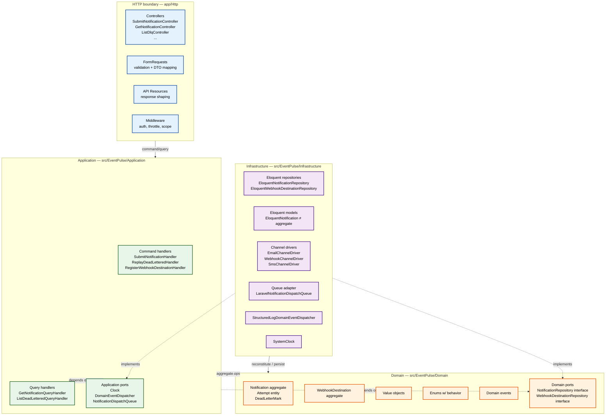
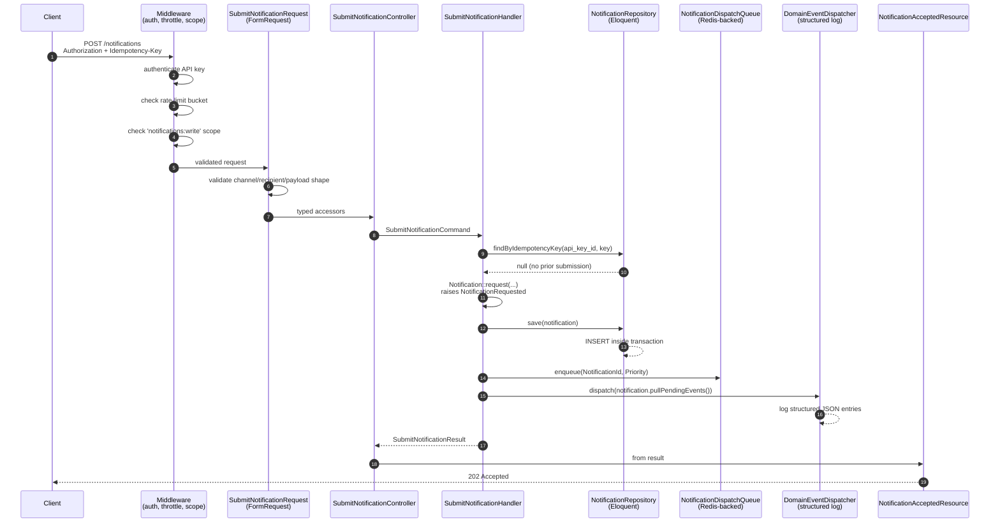
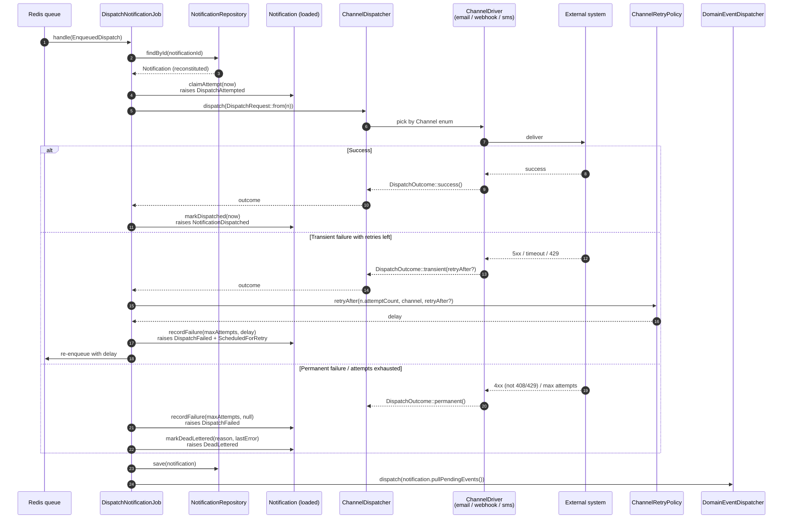
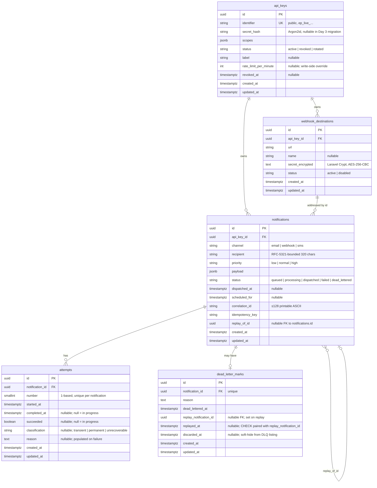

# Architecture overview

**Status:** Living document. Updated as the architecture evolves.
**Last revised:** 2026-05-14 (`v0.1.0`)

This document is the architectural map. It describes the layers, the components within each, the contracts between them, and the runtime flows. It is companion reading to:

- [`docs/domain.md`](./domain.md) — *what* the system models (aggregates, events, invariants)
- [`docs/adr/`](./adr/) — *why* each non-obvious choice was made
- [`openapi.yaml`](../openapi.yaml) — *contract* with the outside world

This document does not duplicate them. It is the *how* — how the pieces fit, and where to find each piece when you want to change it.

---

## 1. The four layers

EventPulse has four explicit layers. Boundaries are enforced by directory structure, namespacing, and a unit-test split that prevents the domain layer from ever loading Laravel.

### 1.1 HTTP boundary — `app/Http`

The Laravel-coupled surface. Controllers are single-action invokables; `FormRequest` subclasses do shape-and-format validation; `JsonResource` subclasses do response shaping. Three middlewares carry the cross-cutting concerns: `AuthenticateApiKey` (resolves bearer token to `ApiKey`), `RequireScope` (checks the key carries the scope the route demands), and `ThrottleApiRequests` / `ThrottleIpRequests` (per-key and per-IP rate limiting). No domain logic, no direct Eloquent queries. The controller's job is: validate input → call handler → return resource.

### 1.2 Application — `src/EventPulse/Application`

Use-case handlers. Each is a class with a single `handle()` method that takes a command DTO (or query DTO) and returns a result DTO. Handlers orchestrate domain operations: load the aggregate via a repository, call methods on it, persist it, release its pending events. They also carry cross-cutting concerns the domain cannot know about: idempotency lookups, correlation-id propagation, transaction boundaries.

The application layer defines its own **ports** for infrastructure dependencies that are operational rather than domain-meaningful — the `Clock`, the `DomainEventDispatcher`, and the `NotificationDispatchQueue`. The repository interfaces (`NotificationRepository`, `WebhookDestinationRepository`) belong to the **domain** layer, where the project rules put them: they are part of the contract the domain exposes for its own persistence, not Laravel concerns. Both kinds of port are implemented by classes in the infrastructure layer. This is the seam that lets the application layer be tested with in-memory doubles.

### 1.3 Domain — `src/EventPulse/Domain`

Pure PHP. No `Illuminate\*`. No facades. No `env()`. The aggregates (`Notification`, `WebhookDestination`), the value objects (`NotificationId`, `CorrelationId`, `EmailRecipient`, `WebhookEndpoint`, …), the enums with behavior (`Channel`, `NotificationStatus`, `Priority`, `FailureClassification`), and the domain events live here.

Domain events are *collected*, not dispatched. `Notification::request()` raises `NotificationRequested` into a private `$pendingEvents` array; `transitionTo()` and `recordFailure()` add their own events similarly. The application layer pulls them after persistence with `pullPendingEvents()` and hands them to the `DomainEventDispatcher`. Tests assert event emission against the aggregate's pending list, not against a global event bus.

The full domain model — terms, lifecycle, invariants, value objects — is described in [`docs/domain.md`](./domain.md).

### 1.4 Infrastructure — `src/EventPulse/Infrastructure`

The implementations of the ports. `EloquentNotificationRepository` maps between the domain aggregate and the `EloquentNotification` persistence model — these are deliberately separate classes. The aggregate is what the domain works with; the Eloquent model is a thin row-mapping object that knows the database schema. The repository's `save()` writes notification + attempts + dead-letter-mark in a single transaction; `findById()` reconstitutes the aggregate from the row tree.

Channel drivers implement the `ChannelDriver` interface. Each driver knows how to talk to one external delivery mechanism — `EmailChannelDriver` uses Laravel's `Mailer`, `WebhookChannelDriver` uses Laravel's HTTP client with the HMAC headers added, `SmsChannelDriver` is a stub with a real interface waiting for a real provider. The `ChannelDispatcher` does not know about any of them; it looks the driver up by `Channel` enum.

---

## 2. Request flow — `POST /notifications` (happy path)

Steps 1–4 are framework concerns and only run inside Laravel's request lifecycle. Step 5 onwards is fully testable without HTTP — a unit test on `SubmitNotificationHandler` can drive the entire flow with `FixedClock`, `InMemoryNotificationRepository`, `InMemoryNotificationDispatchQueue`, and `NullDomainEventDispatcher`.

### Idempotency replay path

If `findByIdempotencyKey` returns an existing notification with the same body, the handler short-circuits: no second persistence, no second enqueue, original response returned with `200 OK` instead of `202 Accepted`. The correlation id of the original submission is preserved — tracing identity belongs to the first writer. If the body differs, the handler throws `IdempotencyConflictException`, which the exception renderer maps to `409 IDEMPOTENCY_CONFLICT`.

---

## 3. Worker flow — dispatch a notification

The retry policy is consulted at the boundary, not in the aggregate. The aggregate's `recordFailure(maxAttempts, retryAfter)` is told the policy's decision; it does not compute the policy itself. This is deliberate: retry tuning is an operational knob, not a domain invariant. See [ADR-0005](./adr/0005-retry-policy-and-dead-letter-strategy.md).

---

## 4. Component map

What's where, what it does, and the ADR it implements.

| Path | Role | ADR |
|------|------|-----|
| `src/EventPulse/Domain/Notification/Aggregate/Notification.php` | Notification aggregate root; state machine + event collection | 0002 |
| `src/EventPulse/Domain/Notification/Entity/Attempt.php` | Attempt entity inside the Notification aggregate | 0002 |
| `src/EventPulse/Domain/Notification/Entity/DeadLetterMark.php` | Optional component marking a notification as dead-lettered | 0002, 0005 |
| `src/EventPulse/Domain/Notification/Enum/NotificationStatus.php` | State machine; `canTransitionTo()` is the source of truth for transitions | 0002 |
| `src/EventPulse/Domain/Notification/Enum/Channel.php` | Channels with behavior (`label()`, recipient-shape contract) | 0002, 0004 |
| `src/EventPulse/Domain/Notification/Enum/FailureClassification.php` | Transient / permanent / unrecoverable classification | 0005 |
| `src/EventPulse/Application/Notification/Command/SubmitNotificationHandler.php` | The use case for `POST /notifications` | 0003 |
| `src/EventPulse/Application/Notification/Command/ReplayDeadLetteredHandler.php` | Idempotent replay of a dead-lettered notification | 0006 |
| `src/EventPulse/Application/Notification/Query/GetNotificationQueryHandler.php` | Read-side for `GET /notifications/{id}` | 0003 |
| `src/EventPulse/Domain/Notification/Repository/NotificationRepository.php` | Persistence port (interface); implemented by Eloquent in infra | 0002, 0003 |
| `src/EventPulse/Application/Shared/Clock.php` | Time abstraction; injected for determinism | 0003 |
| `src/EventPulse/Infrastructure/Notification/Persistence/EloquentNotificationRepository.php` | Reconstitute + persist the aggregate; transactional save | 0003, 0006 |
| `src/EventPulse/Infrastructure/Notification/Channel/ChannelDispatcher.php` | Strategy dispatcher; selects driver by Channel | 0004 |
| `src/EventPulse/Infrastructure/Notification/Channel/EmailChannelDriver.php` | Real driver via Laravel `Mailer` | 0004 |
| `src/EventPulse/Infrastructure/Notification/Channel/WebhookChannelDriver.php` | Real driver with HMAC signing | 0004, 0008 |
| `src/EventPulse/Infrastructure/Notification/Channel/SmsChannelDriver.php` | Stub with real interface contract | 0004 |
| `src/EventPulse/Infrastructure/Notification/Retry/ChannelRetryPolicy.php` | Per-channel exponential backoff with full jitter | 0005 |
| `src/EventPulse/Infrastructure/Notification/Queue/LaravelNotificationDispatchQueue.php` | Adapter from domain queue port to Laravel Bus | 0003 |
| `src/EventPulse/Infrastructure/Notification/Logging/StructuredLogDomainEventDispatcher.php` | Writes domain events as structured JSON log entries | 0006 |
| `app/Http/Middleware/AuthenticateApiKey.php` | Resolves bearer token to `ApiKey` model | 0007 |
| `app/Http/Middleware/RequireScope.php` | Checks the API key carries the route's required scope | 0009 |
| `app/Http/Middleware/ThrottleApiRequests.php` | Per-API-key rate limit, separate write/read buckets | 0009 |
| `app/Http/Middleware/ThrottleIpRequests.php` | Per-IP rate limit for unauthenticated endpoints | 0009 |
| `app/Http/Controllers/Api/V1/HealthController.php` | Liveness + readiness probes | 0009 |
| `app/Exceptions/ApiExceptionRenderer.php` | Maps domain/application exceptions to standardized error envelope | 0003 |

---

## 5. Persistence schema

Composite-unique on `(notifications.api_key_id, notifications.idempotency_key)`. All timestamps are `TIMESTAMPTZ`. Database-level `CHECK` constraints mirror the `Channel`, `NotificationStatus`, `Priority`, `FailureClassification`, and `WebhookDestinationStatus` enums as defence-in-depth (the domain enforces them; the DB constraint catches any future raw-SQL path). Soft state on `webhook_destinations` (via `status`) and on `dead_letter_marks` (via `discarded_at`) — historical data is never destroyed.

---

## 6. Cross-cutting concerns

### 6.1 Correlation IDs

Every request carries an `X-Correlation-Id` header (auto-generated if absent). The id is stored on the notification, passed through to every domain event, attached to every log line, and returned in every API response. A single dispatch flow — from submission through worker pickup through final disposition — shares one correlation id and is reconstructable by grepping the structured logs.

### 6.2 Structured logging

`config/logging.php` defines an `eventpulse` channel emitting JSON Lines. `StructuredLogDomainEventDispatcher` writes a log entry for every domain event with full context. Levels: `debug` for internal state, `info` for successful operations, `warning` for retried failures, `error` for permanent failures, `critical` for unexpected exceptions. Nothing in the dispatch flow uses `Log::info("did a thing")` string concatenation.

### 6.3 Idempotency

Enforced at the database via composite-unique index, not at the cache. The trade-off (DB round-trip per submission vs. Redis lookup) is documented in `SubmitNotificationHandler`'s docblock and is revisitable if the dedup-replay rate ever dominates the endpoint's latency budget.

### 6.4 Rate limiting

`ThrottleApiRequests` keeps separate Redis buckets per API key for write and read operations, with per-key write-side overrides via `api_keys.rate_limit_per_minute` (null = system default of 100/min). Public health endpoints use `ThrottleIpRequests` (60/min/IP). On limit hit: `429 RATE_LIMITED` with `Retry-After` header and standardized error envelope. See [ADR-0009](./adr/0009-rate-limiting-and-health-endpoints.md).

### 6.5 Secrets

`SecretsProvider` interface with `get` / `has` / `rotate`. v1 implementation: `EnvSecretsProvider`. Application code never calls `env()` directly — only `config/*.php` and the provider implementation may. Webhook destination secrets are encrypted at rest via Laravel `Crypt`. API key secrets are Argon2id hashed and never retrieved in plaintext. See [ADR-0007](./adr/0007-secrets-management.md).

---

## 7. Where things go in the future

- **Phase 2** adds infrastructure: a multi-stage `Dockerfile`, a `.github/workflows/` directory with Psalm / PHPStan / Trivy / gitleaks, a `SECURITY.md`, a `docs/DEPLOYMENT.md`. None of this touches the existing layers — it is operational scaffolding around them.
- **Phase 3** adds two new domain concepts: a low-priority embedding job that vectorises notification content into pgvector, and a multi-channel canonical payload + variants. These are additive to the domain, not modifications of it. The variant generation lives in a new `src/EventPulse/Application/Llm/` subtree behind a `LlmProvider` port; the Anthropic and OpenAI implementations are infrastructure.
- **Out of scope, permanently:** the eight items in [ADR-0001](./adr/0001-scope-and-exclusions.md).
